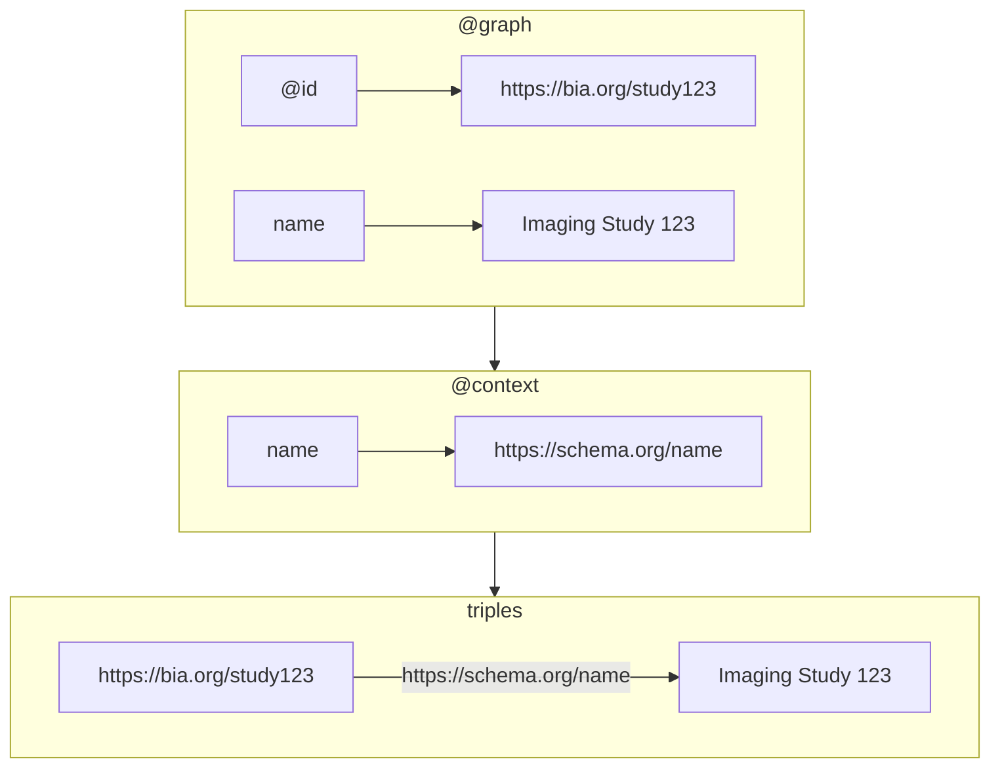
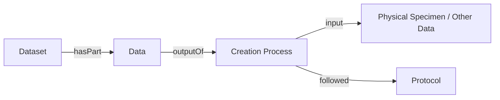
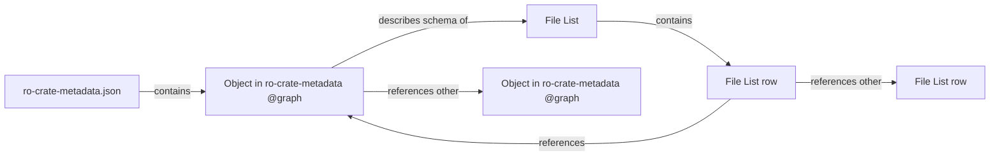

# BIA RO-Crate Validator

This package contains definitions of the structure of RO-Crates when documenting submissions to the BioImage Archive (BIA).

## Installation

The package requires Python 3.13 or newer.

Install the package with pip:

```sh
pip install bia-ro-crate-validator
```

From a source checkout, install the package with:

```sh
pip install .
```

## Validator

This package contains validation logic for BIA RO-Crates. The validator can be run on an RO-Crate using the CLI provided:

```sh
bia-ro-crate validate <path to the directory root of the RO-Crate>
```

To validate the BIA submission profile, which requires a REMBI or MIFA dataset
and their corresponding metadata rules, pass the profile explicitly:

```sh
bia-ro-crate validate --profile bia-submission <path to the directory root of the RO-Crate>
```

Use `-h` or `--help` to see options for the CLI.

For local development, install the project with Poetry:

```sh
poetry lock
poetry install
```

Then run the CLI from the Poetry environment:

```sh
poetry run bia-ro-crate validate <path to the directory root of the RO-Crate>
```

## RO-Crate

RO-Crate is a community supported standard to packaging research objects (RO) with their metadata.

It is designed to be lightweight, while covering a wide range of use cases. It is therefore not limited to biology or imaging, and the specification only requires the presence of very generic information related to the data's publication (authors, license, and a name & description).

An RO-Crate is typically a directory of files (the research objects). The metadata about the files is stored in an ro-crate-metadata.json file that is expected to live alongside the data in a directory ('attached' RO-Crates). There is another form of RO-Crate ('detached') which aims to document web entities and datasets. In this latter case the ro-crate-metadata.json needs to refer to absolute URIs accessible on the web.

The ro-crate-metadata.json is a JSON-LD (linked data) document. It is comprised of an @graph, which contains the content of the metadata, and an @context, which provides a map between terms in the @graph (field names, classes, IDs) to linked data concepts and web entities (such as web published ontologies).

To read more about standard, see: <https://www.researchobject.org/ro-crate/>

## An introduction to RDF, OWL & JSON-LD

This section provides an overview of Resource Description Framework (RDF, see <https://www.w3.org/RDF/>) and Web Ontology Language (OWL, see <https://www.w3.org/TR/owl2-overview/>). It assumes the reader is familiar with the concept of JSON objects, given its established popularity as an API media type.

RDF graphs are edge and node graphs comprised of an unsorted collection of _triples_: positive factual statements of the form: < subject > < predicate > < object >. For example: < paris > < capital of > < france >. Subjects are _entities_ typically referenced by _IRIs_, whereas objects can be _entities_ or _string literals_. Predicates are instances of _rdf:Property_, typically defined in some ontology somewhere.

RDF and OWL are designed to be used in the context of knowledge graphs, which often get acted upon by inference or reasoning engines. As such, they are designed to allow the inference of new statements based off of previous statements. The classes objects belong to are inferrable by the properties used in statements connecting the object.

RDF Graphs can be 'inconsistent' in that they contain statements (perhaps through inference) that disagree with one another, but this does not tell you what is wrong as you might expect from validation. I.e. 2 statements disagree with each other, not that 1 is incorrect because another is correct. Processes closer to traditional validation exist, which are typically described as checking conformance to patterns expressed in the graph (see <https://shex.io/> and  <https://www.w3.org/TR/shacl/>).

Despite the abundance of 'Classes' that you will see in the typical RDF ontology, these features result in a design that is much closer in spirit to functional programming (see [Category Theory](https://rnhmjoj.github.io/category-theory-for-programmers/src/init/table.html)) than object oriented programming.

### JSON-LD

A JSON-LD document is made up of an @context and a payload of json objects (which can be nested under an @graph field - as in the case of an ro-crate-metadata.json). For example:

```json
{
    "@context": {
        "name": {
            "@id": "https://schema.org/name"
        },
        "Dataset": {
            "@id": "https://schema.org/Dataset"
        }
    },
    "@graph": [
        {
            "@id": "http://bia.org/study123",
            "@type": [ "Dataset" ]
            "name": "Imaging Study 123"
        }
    ]
}
```

The design of the @context is to link terms (fields, classes, IDs) to described concepts on the web, while being flexible enough to accommodate pre-existing json structures that might be used by APIs. This @context can be used to map the data under @graph into an RDF graph.



The JSON-LD document above is equivalent to the following graph, made up of 2 statements:

```n3
<https://bia.org/study123> <https://schema.org/name> "Imaging Study 123" .
<https://bia.org/study123> <http://www.w3.org/1999/02/22-rdf-syntax-ns#type> "https://schema.org/Dataset" .
```

I recommend experimenting with the 'Examples' at <https://json-ld.org/playground/> to get a better understanding of JSON-LD.

## BIA RO-Crates & File Lists

Submissions to BIA are typically made up of multiple images, supporting files and metadata describing the subjects of the observations. Each image can have from 2 to 5 dimensions. Supporting files may be scripts, documents, annotations etc. The metadata about all these objects typically covers:

* authorship of the data
* licensing
* information about the biological content of the images
* information about the procedures taken to create the data
* links to other resources relevant to the data

Submissions to the BIA can contain millions of images, and these images can have variations in the above metadata that is important to track on an image-by-image basis. For instance, we have submissions with ~1 million light microscopy images, and a corresponding ~1 million cell segmentation images: one for each light microscopy image.

While it is possible to document this with json objects within the ro-crate-metadata.json, tabular data structures lend themselves to this kind of mass documentation. The BIA requires this kind of file manifest anyway, as a part of validating that the expected data is correctly transferred. Since the BIA is focused on image and imaging metadata typically most files in a submission are images, so it not unreasonable to document the file-level metadata of most files within the stricter schema of tabular format (rather than the more free-form approach within the JSON-LD).

The BIA refers to these manifests as File Lists. While they are in no way covered by the RO-Crate specification, the spec does allow for manifests and other metadata defining documents to be provided alongside the ro-crate-metadata.json.

There are examples of [valid minimum](test/validator/input_ro_crate/test_minimal_valid_ro_crate) and [valid typical](test/validator/input_ro_crate/test_typical_ro_crate) BIA RO-Crates in the tests.

## BIA's conceptual model of imaging metadata

At a very high level, the BIA's data model follows the following overarching theme



(Imaging) data is the output of a creation process (as in the diagram above), which followed the recipe provided by one or more protocols applied to a physical specimen or took some other data as input.

This data is grouped into datasets. Each provides an overview on the information stored in the whole data or a part of it. For instance license is assumed to apply to each individual data where as only some of the images were taken by some of the authors of the dataset.

The more specific recommendations on Biological Imaging Metadata from the _'Recommended Metadata for Biological Images'_  (REMBI, see: <https://www.nature.com/articles/s41592-021-01166-8>) and _'Metadata, Incentives, Formats, and Accessibility guidelines to improve the reuse of AI datasets for bioimage analysis'_ (MIFA, see: <https://arxiv.org/abs/2311.10443>) are then applied to the high-level structure defined above to define the more specific fields and concepts.

## Validation of BIA RO-Crates

If you are not familiar with JSON-LD, there is a short introduction a the bottom of this readme.

### JSON-LD validation

It is non-trivial to fully validate JSON-LD efficiently because the format exists to satisfy two different approaches to data modelling. Individual consumers to JSON-LD documents are typically only interested in one of these and completely disregard the other, though the RO-Crate specification is an exception to this. A JSON-LD is:

1. A json document
1. A graph of RDF triples ( see: <https://www.w3.org/RDF/>)
1. A mapping between the names of fields and classes, and ontology terms (the _'context'_).

For a given mapping and json document the transformation to an RDF is almost deterministic (up to difference in order, _'blank node'_ identifiers, relative identifier bases - typically differences that rarely matter). The inverse is not true, and a single RDF graph can be serialised into multiple differently structured JSON-LD documents even with the same map depending on the processing algorithm used. The standard provides a small set of processing algorithms.

Typically this means that at least 2 of the 3 items need to be validated for both representations to be valid, along with specifying an expected processing algorithm. RO-Crate requires the JSON-LD to be _'flattened compacted'_, which results in a flat list of json objects that refer to one another via identifiers (as opposed to a deeply nested structure), and have short aliased field names (rather than URIs).

### BIA ro-crate-metadata.json validation

Salient features that are validated (and whether they are more json or graph validation):

1. Base RO-Crate & json ld validation: the JSON-LD is _'flattened compacted'_ with an @graph container, all fields have a context term definition, root object, self-defining object exist, and these objects have various fields (see <https://www.researchobject.org/ro-crate/specification>)
1. Objects contain expected fields for that type of object (json*)
1. Referenced IDs exist in the document (graph)
1. The type of the object when referenced conforms to the expected type of the field (json*)
1. Context contains expected term definitions and the fields have not been mapped to different terms (graph/JSON-LD)
1. No 2 objects use the same ID (json) - this isn't so much a requirement, but more a way to avoid something that is likely incorrect

\* These could be graph based if we worried more about the shape of the graph surrounding these entities than the fields present on the json object.

### BIA File List validation

The ro-crate-metadata.json contains information about the File List. The CSVW ontology (<https://www.w3.org/ns/csvw>) is used to described the File List's schema, including linking headers to rdf:Properties from various ontologies.

As a manifest, the expectation is that each row corresponds to a file. Metadata can be provided at the file level, though sometimes files should be combined to form images and metadata is only provided once for the image. Names can be provided to group multiple files into the same object.



The salient features in File List validation are all to do with existence checks of referenced objects.

Validation beings with checks on objects in the ro-crate-metadata.json that describe the File List:

1. That an object of @type 'FileList' exists, and is linked to the study (json)
1. That the schema of the File List contains column definitions that reference the required properties (graph)

Then the contents of the File List is checked with respect to itself, and the contents of the ro-crate-metadata.json:

1. That the columns names correspond to the schema definition the ro-crate-metadata.json.
1. That the values in the file path column are unique.
1. That, for columns that should reference objects in the ro-crate-metadata.json, the values in those columns are ids of objects that exist in the RO-Crate and are of the expected type.
1. That, for columns that should reference other rows in the File List, the values in those columns correspond to either file paths or names of files.
