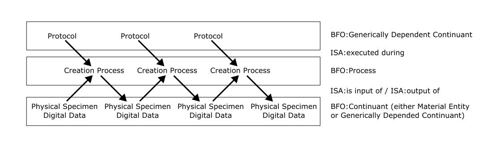
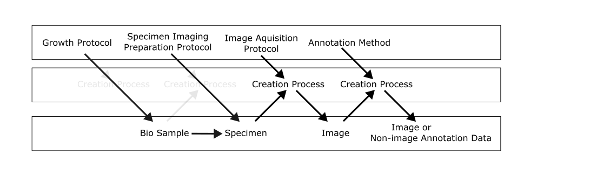
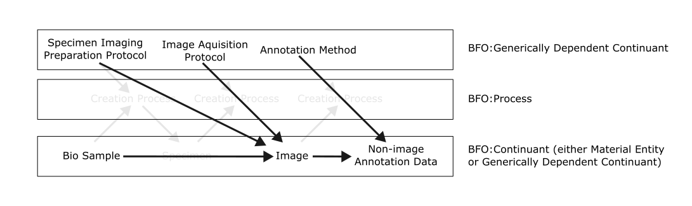
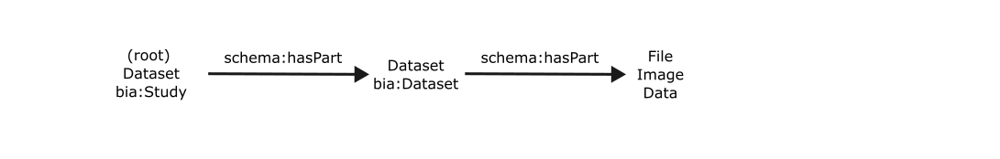
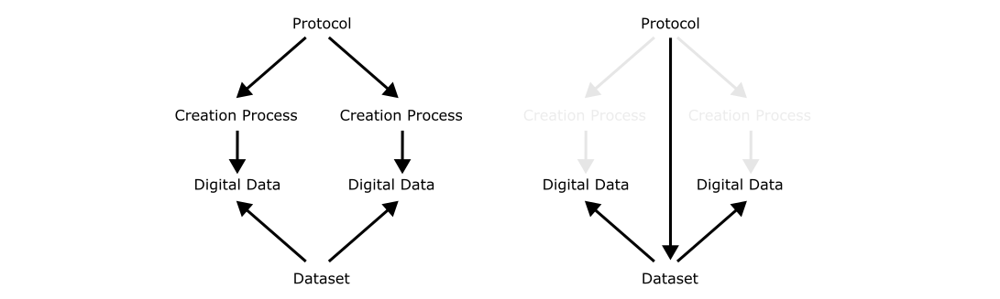

# Data Model Details

This document is about the structure of the BioImage Archive (BIA) datamodels, and includes commentary on the approach to the design.

Because the data is modelled in an RO-Crate, and RO-Crate requires referenced fields and classes to have a term definition in the context, this document contains a lot of discussion on ontological concepts and specific ontologies to provide URIs and definitions for the properties and classes. If any of these terms are unfamiliar to you, there is an overview in the root README for this package.

RO-Crate requires a number of properties and classes from [schema.org](https://schema.org/), but these are not enough to cover the specifics of biological imaging. The biological sciences already make extensive use of ontologies, so we have reviewed relevant ontologies in order to re-use terms or find suitable parents for terms we have to create.

## Basic Formal Ontology

[Basic Formal Ontology (BFO)](https://bfo-ontology.github.io/) is an 'upper ontology' that is often used in scienfitic domains as a parent structure for domain specific 'reference ontologies'.

Many of the most relevant ontologies reuse classes from BFO, such as:

* [Investigation Study Assay Ontology (ISA)](https://isa-specs.readthedocs.io/en/latest/isamodel.html),
* [Ontology for Biomedical Investigations (OBI)](https://obi-ontology.org/docs/core-classes/),
* [Information Artifact Ontology (IAO)](https://github.com/information-artifact-ontology/IAO),
* [OBO Relations ontology](https://oborel.github.io/).
* [Core Ontology for Biology and Biomedicine (COB)](https://github.com/OBOFoundry/COB)

It is therefore a useful reference point to understand the relative position of concepts from these ontologies, as well as where to place our own extensions.

## Upper Ontology

The BIA's data forms into chains of inputs and outputs to processes:

The three main kinds of objects are:

* Protocols that are descriptions of the plan followed during a scientific study.
* Creation Processes which are the event which produced data or a phsyical specimen. For instance, a particular imaging session for a single image.
* Two kinds of inputs or outputs to these creation processes: either physical objects such as a specimen, or digital data. However, we do sometimes also need to fall back to describing abstract classes of such things, rather than the individual elements.

### Detailed explanation on parent classes choice

The protocol is a plan. It has no temporal boundaries, and therefore is a continuant. A protocol describes the generics of any [concretization](http://purl.obolibrary.org/obo/RO_0000059) of itself, and so is not tied to a specific (just as 'redness' describes some aspect the more concrete 'the red colour of a partciular apple' - a specifically dependent continuant). Therefore the class Protocol is a subclass of Generically Dependent Continuant, which matches the protocol classes that exist in [OBI](http://purl.obolibrary.org/obo/OBI_0000272) and [ISA](http://purl.org/isaterms/protocol).

Creation Processes represent the event in which an agent created specific data recording or physical objects. The assumption that some material entity that the process depends on is the agent that initiated the process. Therefore the class CreationProcess is a subclass of [Process](http://purl.obolibrary.org/obo/BFO_0000015) from BFO.

The specimens are phsyical and therefore are straightforwardly a subclass of Material Entity. Digital data is often best modelled using FRBR-style work-expression-manifestation-item: which isn't necessarily aligned with BFO's realist approach to ontology. However, the best fit, as showing the example from the IAO, is to model these as generically dependent continuants, with the reasoning that they depend on the existance of the raw data in some form on a drive at a given point in time.

As mentioned above, we occassionally deal with describing a set of objects rather than the individual. BFO is not designed with this in mind: 'universals', as it calls them, exist in the class space, and are not modelled in the 'instance' space. I suspect this may be why the NCBI taxonomy does not re-use BFO: it's taxonomic ranks (classes of classes) don't fit well. However, the closest match might be generically dependent continuants, in that archetypcal class definitions can be thought of as a pattern which applies to all instances of it.

Therefore in the 3 cases of Physical Specimens, Digital Data, and sets of these, we can use Continuant, or the two more specific classes of Material Entity and Generically Dependent Continuant.

### Properties

ISA's properties are well aligned with our model, and provide inverse property pairs of: 'executes/execuded during', 'has output/is output of', 'has input/is output of' which cover the three main connections around the creation process. All of these have suitable rdfs:domain and rdfs:range definitions.

BFO relies on an intermediary object of a specific dependent continuant, and use the property chain 'realizes' & 'concretizes' to provide this connection. COB has similarly named properties, but with little by either human or machine interpretable definitions it is less clear if they apply to our use case here.

## Specific classes, properties, and shortcuts

Following the recommendations of [Recommended Metadata for Biological Images (REMBI)](https://www.nature.com/articles/s41592-021-01166-8) and [Metadata, Incentives, Formats and Accessibility (MIFA)](https://pubmed.ncbi.nlm.nih.gov/40954297/) for image annotation, we have created more specific classes and fields to describe data and provide signals for validation.

Protocols are subclassed, and while we use _name_ and _description_ from schema.org, we have had to define more specific properties to distinguish the other fields.

### Model shortcuts

We want to simplify to process of submitting data to the BIA. We have typically found users specify protocol and bio sample level information. Due to the vast scale of imaging expierments that is achieveable today, producing millions of images using hundreds of samples grown and treated in batches, it is not always practical (or necessary) to require information be provided at this level.

We therefore allow some simplifications with the assumptions that there exists one-to-one correspondance between the instances of some classes.

One simplification that we make is around the creation process of the specimen. As an imaging database, our primary concern is the about the biological matter that was imaged. Modelling and storing data about derived material entities and the process through which they were created is not within our perview, and we leave that to other databases (such as [BioSamples](https://www.ebi.ac.uk/biosamples/)). We therefore skip some of the creation processes involved in the creation of bio samples and specimens, and agglomerate the protocol metadata across a Growth Protocol and a Specimen Imaging Preparation Protocol.

Further simplification can be made if images do not share the same creation process and there is no process specific information that needs storing. Creation processes typically exist as mediating objects that provide connections between three or more pieces of information. This is a common approach for data which cannot be naturally described in JSON-LD or RDF triples without some form of reification.

It is often the case that for every image we would only have one creation process, as even in time-series data, we would consider all 2-dimensional arrays of data to be part of the same 5-dimensional image. Similarly specimens are often unqiue to imageing sessions. Our model supports both explicit definitions of creation process or this simplified version that assumes a 1-1 correspondance with the creation-processes and the images.

## Studies, Datasets, and aggregate metadata

Following the RO-Crate specificition, we have a root schema:Dataset object to encapsulate all the associated information and associate it with the authors and license of the data.

This corresponds well with REMBI fields on the Study object. It is less clear to what class this corresponds to in biological ontologies. As a collection of data, IAO:Information Content Entity is a decent fit, and that is the approach the [SSBD Ontology](https://bioportal.bioontology.org/ontologies/SSBD) has taken for SSBD datasets (note that SSBD projects exist under Process, and this is where SSBD stores licence information, authorship, etc).

The 'hasPart' relation is usually considered transitive, and the BFO classes used would suggest that if the data is a continuant, the Dataset and Study objects would also be BFO:Continuants (conversely, the 'hasPart' relation of an occurent like a process would expected to be other process or temporal regions).

Note that this means the Study level object here is different to an ISA:Study or ISA:Investigation, that is a subclass of BFO:Process (a BFO:Occurant). As processes, these lend themselves to modelling the 'actions that were performed to create the output data' at various hierarchies, rather than the output data and the protocols (plans) that were followed for those actions.

It is of course possible to merge such concepts into a single instance if necessary. For isntance, it can be useful to treat the Government, Geographical territory, and inhabitants of a country as 3 separate objects of different classes, or refer to all of them at once, depending on the required granularity of modelling. It should, however, be a concious decision to do such a merge, as use of some properties or fields could introduce logical contradictions in the resulting graph.

### Dataset to protocol aggregations

Datasets are aggregations over individual data items, each created by following some protocols. We should only be able to connect the protocols used to create the individual data items if the protocols are used in all cases. However, we use a 2-tier approach to modelling this. In the case of datasets and shortcuts, association data is assumed to be relevant to some part of the data. E.g. some part of the dataset or image is the result of following a Fluorensence Microscopy protocol. There may be other imaging types involved: some images of the dataset might be electron microscopy. Some data inside an image might be correleated electron microscopy.

## Image Representations and FRBR

[Functional Representation of Bibilographic Records (FRBR)](https://www.ifla.org/wp-content/uploads/2019/05/assets/cataloguing/frbr/frbr.pdf) is a recommended approach to modelling library catalogues. It uses a four level hierarchy of objects to cover the abstract Creative Work (a conceptual story, such as the story of 'The Hobbit' by J.R.R. Tolkien), phsyical items (the HarperCollins 1995 editition of 'The Hobbit' on my shelf at home), and two levels of abstraction in between.

This approach to modelling is a good fit for the BIA's image modelling. A particular image file is a representation of the data array of captured in the imaging session. Lossless transformations between image files produce different frbr:Items of the same frbr:Work: whether through exact copies, reorganisation of the array, such as re-chunking ome zarrs, or conversion to a different format e.g betwen zarr and tiff.

BFO (2.0) recommends [(secton see 3.8.2)](https://raw.githubusercontent.com/BFO-ontology/BFO/master/docs/bfo2-reference/BFO2-Reference.pdf) the use of generically dependent continuants for the modelling of works, which corresponds with our re-use of IAO's Information Content Entity. My understanding is that IAO would also model the image representation as Information Content Entity, as there is not an appropriate specifically dependent continuant or even independent continuant to model the data as stored.
